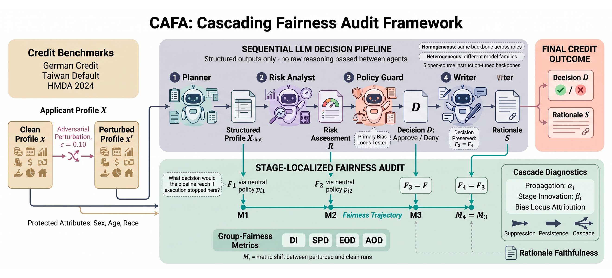

# CAFA: Cascading Adversarial Fairness Auditing

**Where Does Bias Enter the Pipeline? A Theoretical and Empirical Audit of Cascading Fairness in LLM-Powered Multi-Agent Credit Decisioning**

Ahmed Ben Ayed, Samson Quaye, Calvin Nobles

Code, prompts, and data to reproduce every table and figure in the paper.

---

## Overview

Fairness audits of LLM credit systems evaluate a single final decision. When that decision is split across specialized agents, such an audit cannot say **which stage** introduced a disparity.

CAFA formalizes an agentic credit pipeline as a composition of stage-level decision functions, proves bounds on how a fairness violation is suppressed, persists, or amplifies across stages, and localizes where the violation enters.

## Key findings

- **Bias concentrates at the Policy Guard**, which accounts for 69–100% of the perturbation-induced fairness shift across three datasets. The Planner and Writer contribute almost nothing.
- **Decomposition is mechanism-dependent.** It removes a proxy-discrimination effect (mean swing 14.0 → −2.0 points) but makes decisions more sensitive to adversarial perturbation in 19 of 30 configurations, without measurably worsening group parity.
- **The propagation regime is dataset-specific.** German Credit suppresses smoothly; Taiwan Default reinjects at the decision stage; HMDA peaks at risk assessment.
- **Against a full nine-agent MASCA replication**, CAFA reaches comparable group fairness while approving nearly twice as many creditworthy applicants.

## Experimental scope

| | |
|---|---|
| Backbones | Llama-3.1-8B, Mistral-7B-v0.3, Qwen2.5-7B, Gemma-2-9B, Phi-4-mini |
| Datasets | German Credit, Taiwan Default, HMDA (Illinois 2024) |
| Protected attributes | Sex, age (German, Taiwan); race, sex (HMDA) |
| Baseline ladder | Zero-shot, few-shot, CoT, single-agent multitask, MASCA (9 agents), CAFA homogeneous, CAFA heterogeneous |
| Conditions | Clean, ε=0.10 perturbation, proxy-discrimination probe |

---

<p align="center">
  
</p>

## The CAFA pipeline

A credit decision is split across four agents, which exchange structured JSON only. No agent sees another's raw reasoning text.

1. **Planner** : reads the serialized applicant profile and extracts the factors relevant to creditworthiness, each with the applicant's actual value. It makes no decision.
2. **Risk Analyst** : weighs the listed factors, favorable and unfavorable alike, and assigns a risk level of LOW, MEDIUM, or HIGH with a one-sentence summary. It makes no approval decision.
3. **Policy Guard** : checks the risk summary against three explicit severity conditions and reports each as true or false. The decision is then computed in code: deny if any condition holds, approve otherwise. This is where bias concentrates.
4. **Writer** : produces the rationale a loan officer would see, based only on the decision, policy notes, and risk level. It cannot change the decision.

Two backbone configurations are evaluated: **homogeneous**, where one model fills all four roles, and **heterogeneous**, where a different model family fills each role by round-robin rotation.

## How the audit works

1. **Stage truncation** : recovers the counterfactual decision each stage would reach on its own, by routing its output through a neutral policy
2. **Propagation coefficients** : estimate how much of a violation each transition transmits downstream
3. **Bias-locus attribution** : decomposes the final fairness shift into per-stage contributions
4. **Rationale alignment** : measures whether the written explanation reflects the reasoning recorded upstream

---

## Quick Start

### Step 1: Clone the repo

```bash
git clone https://github.com/qsamson/cafa-credit-audit.git
cd cafa-credit-audit
```

### Step 2: Install the environment

```bash
pip install -r requirements.txt
```

Analysis runs on CPU. Generation requires a GPU with roughly 24 GB of memory; all models are loaded 4-bit NF4 quantized.

### Step 3: Get the data

German Credit (UCI id 144) and Taiwan Default (UCI id 350) download automatically via `ucimlrepo`.

HMDA must be fetched from the CFPB Data Browser:

```bash
python src/download_hmda.py   # years=2024, states=IL, loan_purposes=1
```

Records are filtered to originated or denied applications with reported race, sex, income, and debt-to-income ratio, then sampled 75 approved / 75 denied. Exact filters are in `data/hmda_filter.md`; the resulting applicant IDs are in `data/applicant_ids/`.

### Step 4: Reproduce the results

Analysis alone, from the released model outputs:

```bash
python src/analysis.py
```

This regenerates every table and figure into `results/` without calling any model.

To regenerate the model outputs from scratch:

```bash
python src/run_baselines.py    # rungs 1-4
python src/run_pipeline.py     # CAFA homogeneous + heterogeneous, clean + perturbed
python src/run_masca.py        # nine-agent MASCA replication
```

Each script checkpoints per applicant and resumes automatically, so interrupted runs can be restarted with the same command.

## Project structure

```
├── prompts/
│   ├── cafa_stages.md          Planner, Risk Analyst, Policy Guard, Writer
│   ├── baselines.md            zero-shot, few-shot, CoT, single-agent multitask
│   └── masca_agents.md         all nine MASCA agents
├── src/
│   ├── run_baselines.py
│   ├── run_pipeline.py
│   ├── run_masca.py
│   ├── download_hmda.py
│   ├── serialization.py        per-dataset serializers and perturbations
│   ├── truncation.py           pi_1, pi_2, and the alternative pi_2
│   └── analysis.py             metrics, coefficients, bootstrap, figures
├── data/
│   ├── applicant_ids/          sampled IDs per dataset, seed 42
│   └── hmda_filter.md
├── results/
│   ├── checkpoints/            raw JSONL model outputs
│   ├── tables/                 CSV for every table in the paper
│   └── figures/
├── CAFA-Framework.png
├── requirements.txt
└── README.md
```

## Reproducibility notes

- **Seed 42** for all sampling; greedy decoding (`do_sample=False`) for all generation.
- **Decisions are computed in code**, not by the model: the Policy Guard emits three boolean condition flags, and the pipeline denies if any flag is true. This removes flag/decision inconsistency by construction.
- **Protected attributes are never perturbed.** Only mutable financial fields are modified.
- **Stage inputs are structured only.** No stage sees another's raw reasoning text.
- Model outputs in `results/checkpoints/` are the exact runs reported in the paper, so `analysis.py` reproduces the published numbers.

## Citation

```bibtex
@article{benayed2026cafa,
  title   = {Where Does Bias Enter the Pipeline? A Theoretical and Empirical Audit
             of Cascading Fairness in LLM-Powered Multi-Agent Credit Decisioning},
  author  = {Ben Ayed, Ahmed and Quaye, Samson and Nobles, Calvin},
  year    = {2026}
}
```

## Acknowledgements

This research used resources of the Argonne Leadership Computing Facility, a U.S. Department of Energy Office of Science user facility at Argonne National Laboratory, supported under Contract No. DE-AC02-06CH11357. Computational resources were provided through a Director's Discretionary award, Project EDGEGUARD, on the Polaris system.

## License

MIT
